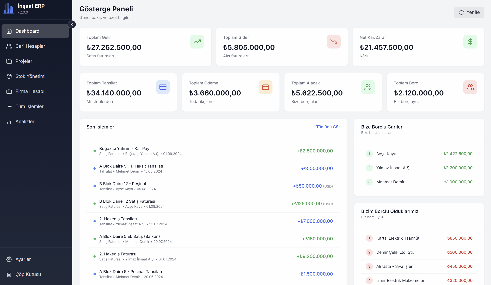

# İnşaat ERP Sistemi

İnşaat firmaları için geliştirilmiş kapsamlı masaüstü ERP uygulaması. Cari hesapları, projeleri ve stok yönetimini tek bir yerden yönetin.



**[English README](README.md)**

## Özellikler

- **Cari Hesap Yönetimi** - Firma ve cari hesap takibi, çoklu para birimi desteği (TRY, USD, EUR, GBP)
- **Proje Yönetimi** - Proje bazlı gelir/gider takibi ve karlılık analizi
- **Stok Kontrolü** - Malzeme yönetimi, stok hareketleri ve düşük stok uyarıları
- **Finansal Analiz** - Grafikler ve istatistiklerle interaktif gösterge paneli
- **Veri İçe/Dışa Aktarım** - Toplu işlemler için Excel (XLSX) desteği
- **Bulut Yedekleme** - Google Drive entegrasyonu ile güvenli yedekleme ve geri yükleme
- **Çöp Kutusu** - Silinen verileri geri getirme imkanı
- **Klavye Kısayolları** - Hızlı gezinme için özelleştirilebilir kısayollar

## Teknolojiler

| Kategori | Teknolojiler |
|----------|-------------|
| Arayüz | React 18, TypeScript, Tailwind CSS |
| Masaüstü | Electron 28 |
| Veritabanı | SQL.js (WebAssembly ile SQLite) |
| Durum Yönetimi | React Query (TanStack Query) |
| Grafikler | Recharts |
| Doğrulama | Zod |
| Test | Vitest, Playwright |
| Bulut | Google Drive API |

## Kurulum

### Gereksinimler

- Node.js 18+
- npm 9+

### Geliştirme

```bash
# Depoyu klonlayın
git clone https://github.com/feyzanuraydinn/insaat-erp.git
cd insaat-erp

# Bağımlılıkları yükleyin
npm install

# Geliştirme modunda çalıştırın
npm run dev
```

### Üretim Derlemesi

```bash
# Windows yükleyicisi oluşturun
npm run build

# Çıktı: dist/İnşaat ERP Setup {versiyon}.exe
```

## Proje Yapısı

```
src/
├── main/           # Electron ana işlem (IPC, yedekleme, loglama)
├── pages/          # Uygulama sayfaları (Dashboard, Projeler, vb.)
├── components/     # Tekrar kullanılabilir UI bileşenleri
├── database/       # SQL.js veritabanı katmanı
├── hooks/          # Özel React hook'ları
├── utils/          # Yardımcı fonksiyonlar (doğrulama, formatlama, sabitler)
└── types/          # TypeScript tip tanımları
```

## Güvenlik

- Ana ve renderer süreçleri arasında izolasyon
- Zod şemalarıyla IPC doğrulaması
- Veritabanı işlemleri için hız sınırlama
- Content Security Policy (CSP) başlıkları
- Parametreli SQL sorguları
- Şifreli kimlik bilgisi depolama

## Test

```bash
# Birim testleri
npm test

# E2E testleri
npm run test:e2e

# Kapsam raporu
npm run test:coverage
```

## Lisans

Bu proje kişisel kullanım içindir.
